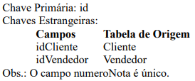
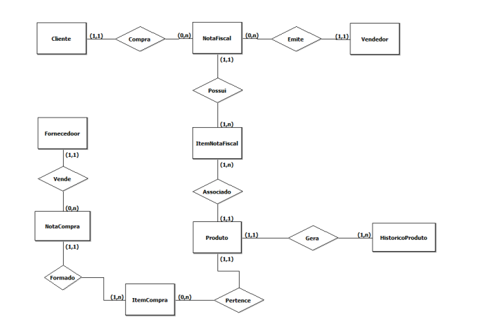

**Instituto Federal Sudeste de Minas Gerais – Campus Barbacena**

**Curso de Tecnologia em Sistemas para Internet**

**Disciplina: Estruturas de Dados** I

**Prof.: Wender Magno Cota**

# Primeiro trabalho Prático

## **Descrição do Problema**

Em Alvinópolis City, que é a mais bela e pacata cidade do Brasil, o senhor Louco das Pedras, é 
proprietário da única loja de produtos farmacológicos. Atualmente, como ele é um lunático, faz o 
controle dos dados de sua loja usando anotações em papel, ou seja, a antiga e conhecida caderneta. 
Um belo dia, o alucinado, louco e munheca de samambaia resolveu conhecer a praia de Iraparaug. 
Para chegar lá, ele resolveu usar o meio rodoviário, utilizando um método adotado por vários 
estudantes para visitar parentes morando em outras cidades: carona. Vale ressaltar que Alvinópolis 
City possui um moderno aeroporto, com voos regulares para todos os aeroportos do Brasil.
Chegando na cidade praiana, o sortudo conheceu uma mocinha com o codinome **Virgininha Só Que** 
**Só**. Como ela é uma pessoa extremamente bem informada, principalmente a respeito de dinheiro e 
como evitar utilizá-lo, após uma rápida conversa (afinal, tempo é dinheiro), Louco das Pedras 
finalmente decidiu acatar os conselhos recebidos: informatizar sua loja.
Após seu retorno à cidade natal, comprou um único computador e pelas informações passadas pela 
amiga, que no segundo período de Tecnologia em Sistemas para Internet - Campus Barbacena há 
excelentes programadores, resolveu contratar os serviços de tais alunos para desenvolver um software 
para gerenciamento da sua loja.

## **Tabelas**

### **Cliente**

### **NotaFiscal**

### **ItemNotaFiscal**

### **Produto**

### **Vendedor**

### **Fornecedor**

### **NotaCompra**

### **ItemNotaCompra**

## **Funcionalidades**

1. Fazer a manutenção das tabelas Cliente (cadastro, alteração, consulta e Listagem).
A consulta deve ser feita pelo id, CPF e o prefixo do nome.

2. Fazer a manutenção da tabela Vendedor (cadastro, alteração, consulta e Listagem).
A consulta deve ser feita pelo id, CPF e o prefixo do nome.

3. Fazer a manutenção da tabela Fornecedor (cadastro, alteração, consulta e Listagem).
A consulta deve ser feita pelo id, CNPJ e o prefixo do nome.

4. Cadastro de um produto. Atribuir o valor zero ao campo quantidadeEstoque.

5. Efetuar uma venda
Inicialmente fazer a autenticação do Vendedor(cpf e senha) e em seguida realizar a validação do 
cliente(campo id). Após a realização das operações anteriores, criar um Carrinho de Vendas que deve 
ser um vetor dinâmico, cujo tipo base, será uma struct formada pelos campos idProduto, 
quantidadeVendida e valorVenda. Após a confirmação da venda, deve-se atualizar a tabela de 
produtos e criar uma nota fiscal referente a venda e um registro de ItemNotaFiscal para cada produto 
vendido.
Obs.:
    * Para o campo dataCompra da tabela NotaFiscal apresentar a data atual do Sistema Operacional, 
mas possibilitado ao usuário alterar tal campo com outra data.
    * O Vendedor após realizar a autenticação pode efetuar vária vendas, bastando selecionar um 
novo Cliente.
    * Durante a venda o Vendedor pode cancelar um produto do Carrinho, bem como alterar a 
quantidade do mesmo, respeitando a quantidade existente em estoque.
    * O carrinho não pode possuir dois produtos iguais.
    * O campo valorVenda do carrinho de Compras deve receber o valor do campo 
precoUnitario(obtido da tabela Produto).

6. Efetuar uma compra
Criar um carrinho de compras. Observe que cada compra deve ser efetuada de um fornecedor. Tal 
carrinho deve ser um vetor dinâmico, cujo tipo base, será uma struct formada pelos campos idProduto, 
quantidade e valorUnitario. Após confirmar a efetivação da compra, deve-se atualizar a tabela de 
produtos, ou seja, a quantidade em estoque e criar uma nota de compra referente a mesma e um 
registro de itemNotaCompra para cada produto comprado.
    * Para o campo dataCompra da tabela NotaCompra, apresentar, inicialmente, a data atual do Sistema 
Operacional, mas possibilitado ao usuário alterar tal campo com outra data.
    * Permitir a exclusão de um produto do Carrinho de Compra, bem como alteração da quantidade, 
antes da confirmação da operação de compras(Fechamento do Carrinho de Compras).
    * O carrinho não pode possuir dois produtos iguais.

7. Atualizar preço
Permitir que se altere o preço de um único Produto ou de todos, em um determinado %. Criar um 
registro no arquivo de HistoricoPreco para cada produto que teve seu preç o alterado. Tal arquivo 
deve possuir os campos: idProduto, dataAlteracao, Valor). A chave primária é formada pelos 
campos(idProduto+dataAlteracao).

8. Relatórios
    1. Dados de uma nota Fiscal e os itens associados a ela.
    2. Dados de uma compra e os itens associados a ela.
    3. Compras efetuadas por um cliente em uma data específica, bem como em um intervalo de 
datas. Mostrar os dados da nota junto com os produtos pertencentes a ela.
    4. Vendas efetuadas por um vendedor em um dia específico.
    5. Vendas realizadas por um vendedor em um determinado mês.
    6. O vendedor(es) com maior valor de venda em um determinado mês.
    7. O vendedor(es) com maior valor de venda em um intervalo de datas.
    8. Histórico de valor de venda de um determinado produto. Estes dados são obtidos no arquivo 
Histórico Produto.

Nota: Permitir que o usuário escolha se deseja que o relatório seja apresentado na tela do dispositivo 
ou em arquivo.

## **DER – Sistema da Loja de Produtos Farmacológicos**

Faltou um atributo identificador no relacionamento **Gera (dataAlteração).**

## **Observações Finais:**
1. O código deve ser feito em usando a linguagem C.
2. O código deve compilar usando C padrão (ANSI C). Basta evitar utilizar funções específicas 
de uma determinada plataforma( Windows, Linux, etc).
3. Utilizar TADs.
4. O código deve compilar sem nenhum warning! Você pode verificar se seu código compila 
sem warnings com o seguinte comando no Linux (opcional):
gcc -Werror arquivos.c.
5.  Usar auto-incremento para os campos id, ou seja, um número único número seja gerado 
quando um novo registro é inserido na tabela. Cada campo id deve começar de 1(um).
6. Não há necessidade de se preocupar com concorrência ao acessar a base de dados, visto que,
o sistema não é multiusuário, não sendo executado em rede, ou seja, um único computador 
com a aplicação e a base de dados.
7. Trabalhos com cópias integrais ou parciais receberão nota zero.
8. Usem comentários na dose certa.
9. Os nomes dos campos, tipos e tamanho devem obedecer a especificação.
10. Os nomes dos arquivos devem ser iguais aos adotados no texto com a extensão dat.
11. Todo campo do tipo texto deve ser convertido para maiúsculo e sem acentuação.
12. Comecem logo, pois a data de entrega jamais estará tão distante como nesse momento.